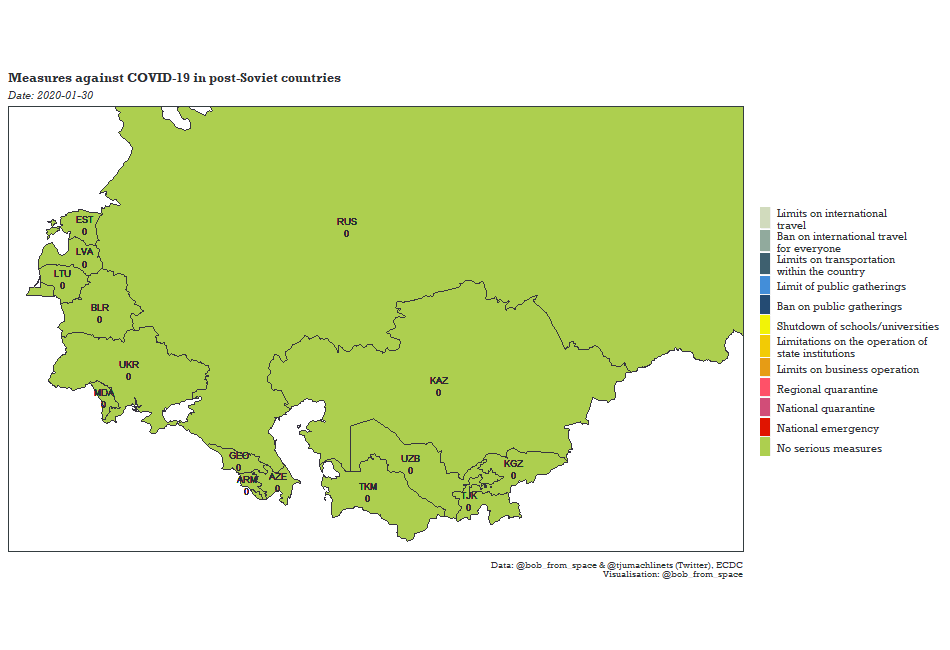

# Visualising COVID-19 government measures, specifically in post-Soviet countries

This repository includes data, coding templates, and the code (written in R) to visualise the number of COVID-19 cases on post-Soviet space according to the European Centre for Disease Prevention and Control (ECDC) and the sequence of government responses to that.

***Authors***:
1. Nina Ilchenko

2. Arturs Holavins

## Visualisation of the data
<!-- -->
